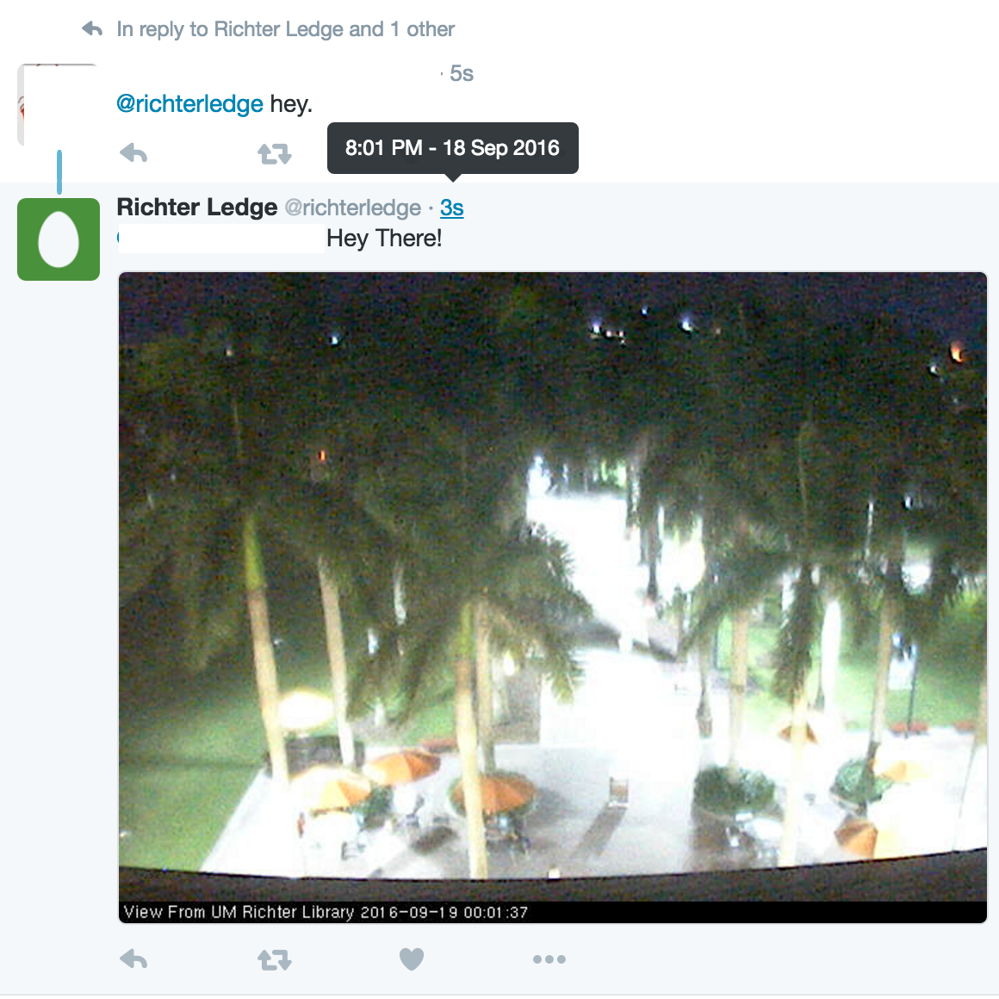

# Twitter Python Auto-response Bot
My University publishes a list of some public webcams. I was bored on a Sunday afternoon and decided to build a little robot that would respond to tweets with a picture of the webcam.

In other words, its a tribute to http://www.twitter.com/window301

This is a twitter auto-response bot. The bot waits for a mention, then grabs the current image from a webcam on campus. It replies with the image and a random phrase.

## CREDITS
- The responder part is a nice piece of code I morphed from @twitterdev. https://github.com/twitterdev/sample-python-autoreply/blob/master/AutoResponse.py
- The image scraper I built using a classic url handler.
- I was lucky that the axiscam actually takes second-by-second jpegs and dumps them into a public folder on its "server". you just have to know where to look, grab the jpeg, and bam.

## To Run
The finished script is inside `twitter-autoresponder.py`. The only thing you will need is to get your own API keys for twitter, by becoming a developer and registering the app yourself. Then, fill out the    `.twitter` file accordingly with your respective API keys.

## Proof

## Changelog:
- The original script used to use eliza to make responses, but that just didn't work well. Now, it just pulls a random phrase from an array.

## License
Do whatever you want. I hacked this puppy together in 45 minutes.
